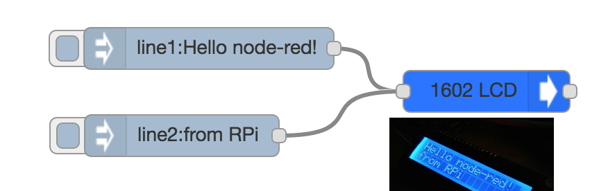

##Intro and Usage##

A simple node-red node that provides basic control of 1602 LCD's with i2c driver backpacks (using PCF8574P drivers). Based on the [i2c-lcd](https://github.com/sweetpi/i2c-lcd/) library.

Use topic *line1* and *line2* to send message payload to each line, and topic *init* to clear screen. Currently not checking for lengths.

Tested on Raspbian Jessie and should work with all RPi models.

##Requirements##

- Raspberry Pi of your choice
- A LCD 1602 panel that has an i2c driver
- i2c-lcd (available in npm repo, but may require a manual compile since the i2c library v0.1.x do not compile on current node versions)

##Notes##

- Designed to work with [Infusion System's PiShield](https://infusionsystems.com/pishield/) where everything is converted to 5V, but should also work directly by connecting directly to the i2c pins
- Should work fine on a larger display (e.g. 2004), but addtional lines are not supported by default
- Super fast updates can cause the display to glitch out, so consider using the Delay node in speed limiting mode if you have input that changes very quickly
- Feel free to suggest new features and corrections!

---
Johnty Wang (johnty.wang@mail.mcgill.ca)

Input Devices and Music Interaction Laboratory

McGill University and Infusion Systems

July 2016
